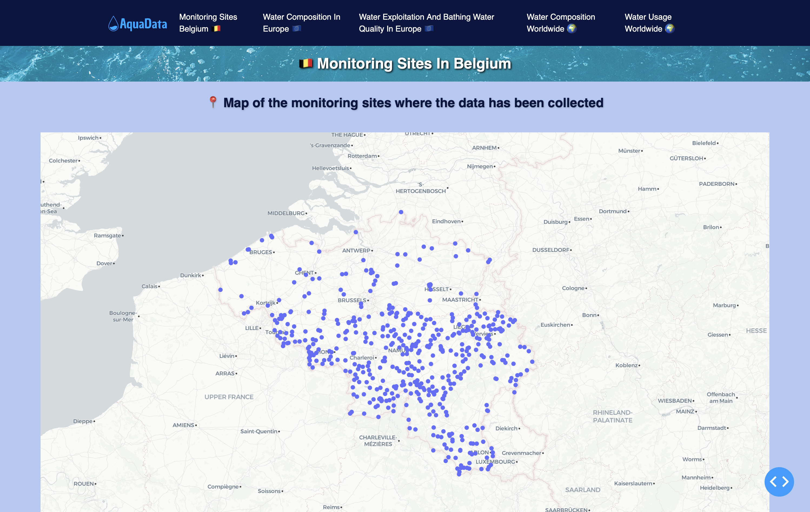

# AquaData : Public Water Quality Data Analysis

Project developed as part of the **INFO-F308** course (Université Libre de Bruxelles) and presented at **Printemps des Sciences 2025 (Eureka)**.

Authors : Noé DEPAEPE, Franklin FLAMENT, Thomas JOSEPHY, Mikael TOM

Date : 16/05/2025




## Project Description

Water quality is essential to both human health and ecosystems: water pollution threatens a quarter of all freshwater species and is linked to more than 80% of diseases worldwide. Yet existing tools (Water Quality Portal, WISE, GEMStat, Our World in Data, …) tend to be either poorly accessible to the general public, geographically limited, or lacking any predictive model.
 
**AquaData** is an interactive web application that centralizes, cleans, and visualizes public datasets on water quality and water use, at the scale of Belgium, Europe, and the world. The project was designed to be **scientific**, **educational**, and **accessible** to a non-technical audience. It was indeed presented to a general audience at Printemps des Sciences 2025.

The project follows a classic Data Science pipeline:
1. **Collection** of data from three public sources: [GEMStat](https://gemstat.org), [European Environment Agency (EEA)](https://www.eea.europa.eu/), and [AQUASTAT](https://www.fao.org/aquastat).
2. **Cleaning / preprocessing**: removal of duplicates, null values, and outliers (negative or extreme values), harmonization of country codes (ISO2 → ISO3), export to lightweight `.json` files to speed up loading (see the SQLite vs JSON comparison in the report).
3. **Statistical exploration**: computation of empirical means per country and per chemical compound.
4. **Spatial visualization**: interactive choropleth maps (linear or logarithmic scale) and a map of monitoring sites in Belgium.
5. **Temporal and predictive analysis**: polynomial regression (degrees 1 to 3, validated with `TimeSeriesSplit` and RMSE) to predict the evolution of water use up to 2030.


**The full methodology, mathematical foundations, sources and detailed results are available in the project's scientific report: [`docs/report.pdf`](docs/report.pdf).**

**The material used for the presentation of the project at Printemps des Sciences 2025 is also available in the [`docs/`](docs/) folder:**

- [`docs/Description-G1A.docx`](docs/Description-G1A.docx) : a short written description of the project, used to introduce it to visitors.
- [`docs/poster-G1A.pptx`](docs/poster-G1A.pptx) : the poster displayed during the event, summarizing the motivation, methodology, and key visualizations.
- [`docs/Powerpoint-G1A.pptx`](docs/Powerpoint-G1A.pptx) : the slide deck used to present the project live.

## Features
The application consists of 5 main pages:

- **Monitoring Sites Belgium** : Interactive map of Belgian monitoring sites (clickable to display detailed observed compounds), comparison of Belgium's water composition vs. the EU average, and the evolution of bathing water quality and the Water Exploitation Index (WEI+).
- **Water Composition in Europe** : Choropleth map of the average concentration of various pollutants (Ammonium, BOD5, Cadmium, Mercury, Nickel, Lead) per European country, with a linear/logarithmic scale toggle, comparison against EU Water Framework Directive regulatory thresholds, and a ranking of the most polluted countries.
- **Water Exploitation & Bathing Water Quality** : Visualization of the Water Exploitation Index and bathing water quality (coastal/inland) across Europe.
- **Water Composition Worldwide** : Global timelapse of water's chemical composition (Copper, Lead, Zinc, pH, heavy metals, nutrients…) by year range.
- **Water Usage Worldwide** : SDG 6.4 indicators (water use efficiency, water stress) by country, with **predictions up to 2030** obtained via polynomial regression (the best degree is automatically selected using RMSE).

Cross-cutting features: interactive maps and charts (zoom, hover, click), dynamic selectors/filters (pollutant, country, year, log scale), educational descriptions for each indicator, and a custom design.

## Requirements :

- Python 3.10+
- pip (Python package installer)

The libraries used are listed in [`requirements.txt`](requirements.txt), including: `dash`, `dash_bootstrap_componentsplotly`, `pandas`, `numpy`, `pycountry`, `scikit-learn`, `sqlite3`

## Installation and Launch

1. **Install dependencies**
```bash
   pip install -r requirements.txt
```
2. **Run the application**
```bash
python3 src/app.py
```

The application is then available in a browser at: **http://127.0.0.1:8050**

## Problem with the data ?
**Get the data : **
The application reads already-cleaned `.json` files from the `json/` folder. If this folder is not provided or needs to be regenerated from the raw data (`ddb/` folder, containing CSV/SQLite exports from GEMStat, EEA, and AQUASTAT — see links in the report), run:
```bash
python3 src/jsonGenerator.py
```

**Predictions : **
To regenerate the SDG 6.4 (water use) predictions:
```bash
   python3 jsonPredictionsWaterUsage.py
```
## Data Sources
- [GEMStat](https://gemstat.org) : Global Environmental Monitoring System for Freshwater Quality (UN/UNEP)
- [European Environment Agency (EEA)](https://www.eea.europa.eu/themes/water) : Water Information System for Europe
- [AQUASTAT](https://data.apps.fao.org/aquastat/?lang=en) : FAO's global information system on water and agriculture

## License / Citation
© 2025 AquaData — Group 1A (INFO-F308, ULB). See the [full report](docs/report.pdf) for bibliographic references and detailed data sources.
